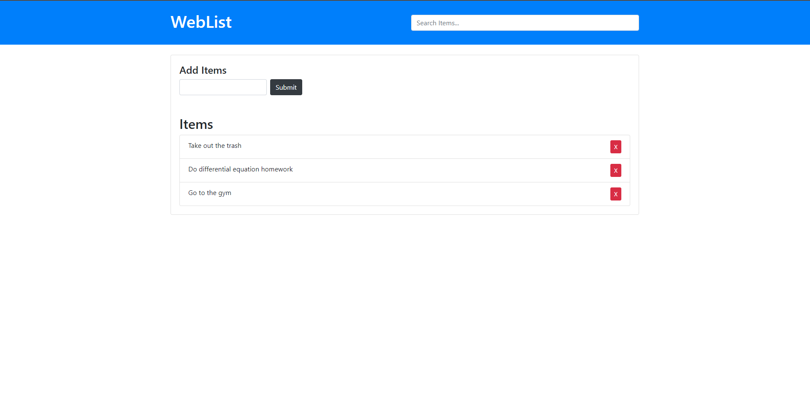

# WebList

---

### Table of Contents

- [Description](#description)
- [How To Use](#how-to-use)
- [Author Info](#author-info)

---

## Description

WebList is a simple website to gather user information and store it in the web browser with no need for a server. In addition, there is a search bar to allow the user to display only the items matching the search field. 

#### Technologies

- HTML
- CSS Bootstrap Framework
- Vanilla Javascript

---

## How To Use

This project is relatively simple to use. 
* Add an item by typing into text field under "Add Items" and hitting the submit button
* Delete an item by clicking the red box with a X
* Search for an item in the list by typing the item in the top right text field

---

## Author Info

- LinkedIn - [@StephenPalazzo](https://www.linkedin.com/in/stephenpalazzo)
- Website - [Stephen Palazzo](https://stephenpalazzo.com)

[Back To The Top](#WebList)